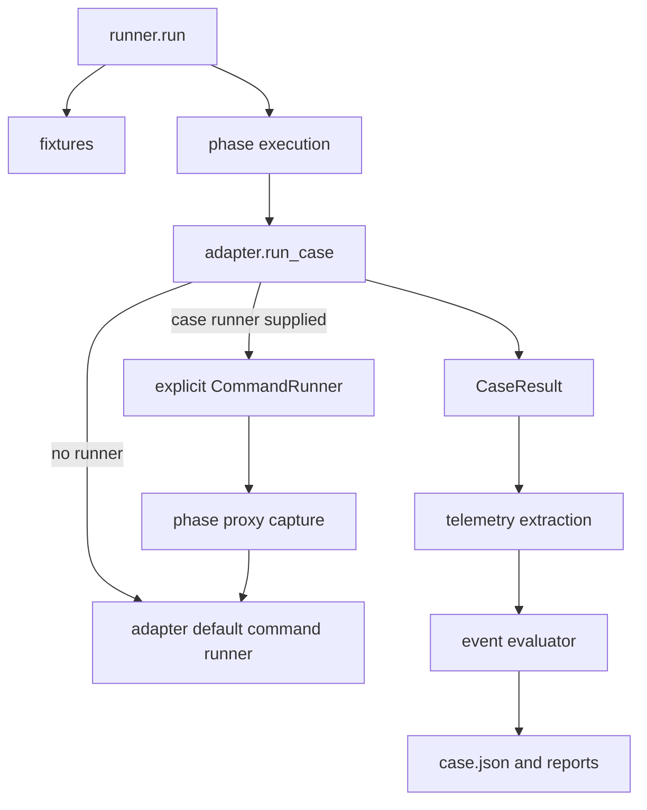

# A+ Runner Decomposition

## Goal Capsule

- **Objective:** Make runner execution easier to understand and extend without changing benchmark behavior, case artifacts, or the published report snapshot.
- **Means:** Introduce an explicit per-case `CommandRunner` seam and move fixture setup, phase execution, proxy capture, and final verdict normalization behind focused modules (KTD1, KTD2, KTD3).
- **Authority:** Preserve current CLI behavior, status precedence, artifact metadata, and the existing public snapshot. The explicit user choice of the A+ path controls the architecture; implementation details follow the current adapter and test contracts.
- **Stop conditions:** Do not add a new public phase API, publish a 30-case report, redesign result schemas, or change agent policy semantics in this change.
- **Execution profile:** Standard cross-cutting refactor with characterization-first verification.
- **Tail ownership:** The implementation owns focused tests, full regression verification, simplification of touched code, and a final diff review. No push or PR is part of this plan.

---

## Product Contract

### Summary

The benchmark runner currently combines orchestration, static and live fixtures, proxy lifecycle management, warmup/measured phase routing, and verdict overrides in one large module. Proxy capture changes an adapter method at runtime, which makes the extension point implicit and fragile even though modifying agent behavior is an intentional capability of the project.

The refactor keeps the runner's observable behavior while making the extension points named, local, and testable. Agent adapters remain responsible for agent-specific command construction and result classification. The runner supplies an explicit command executor only when a case needs phase-aware proxy capture.

### Problem Frame

`gripprobe/runner.py` is currently the ownership boundary for unrelated concerns. The phase proxy path temporarily replaces `adapter.run_command`, then restores it in a `finally` block. That works for the current sequential flow but hides the dependency from adapter implementations, complicates fakes, and makes future execution changes easy to apply to the wrong layer.

### Requirements

- R1. Preserve the existing CLI run contract, including warmup and measured execution, status precedence, timing fields, telemetry metadata keys, artifact paths, manifest shape, and report output.
- R2. Provide an explicit per-case command execution seam that can observe or modify command arguments and environment while delegating to the adapter's normal command behavior.
- R3. Remove production use of dynamic assignment to `adapter.run_command`; phase-aware proxy capture must use the explicit seam and have deterministic start, stop, fallback, and error behavior.
- R4. Keep agent behavior modifiable through the existing adapter implementations and model/agent policy overrides. Do not replace those mechanisms with a generic plugin framework.
- R5. Separate fixture setup, phase execution, proxy capture, and verdict evaluation into focused modules while keeping `run()` as the high-level coordinator.
- R6. Keep touched code readable: use descriptive names, narrow data objects, explicit lifecycle boundaries, and short comments only for non-obvious cleanup or compatibility behavior.
- R7. Do not modify `docs/report/reports-v1/` or generate and publish any new aggregate snapshot.

### Acceptance Examples

- AE1. A normal non-proxy case uses the adapter's existing command implementation and produces the same result and case artifacts as before.
- AE2. An Ollama proxy case sends warmup commands through the warmup proxy and measured commands through the measured proxy without replacing an adapter method.
- AE3. A test or future adapter can pass a command runner that records or modifies a command for one case without changing global adapter state.
- AE4. If one phase proxy cannot start or stop, the command still follows the existing fallback path, the phase is marked with the existing error metadata, and force mode still produces the existing harness verdict.
- AE5. Existing adapter-specific policy overrides, command construction, and direct adapter tests continue to work when no command runner is supplied.

### Success Criteria

- The production code contains no assignment that replaces `adapter.run_command` at runtime.
- The runner's proxy path is expressed as an explicit command runner passed into `run_case` for the current case.
- Fixture, phase, proxy, and verdict responsibilities have clear module owners and unit tests.
- The full test suite passes and `docs/report/reports-v1/` remains byte-for-byte unchanged.

### Scope Boundaries

#### In scope

- Extracting the current workspace fixtures and live web challenge helpers from `runner.py`.
- Adding the explicit command runner contract and threading it through the six built-in adapters.
- Extracting phase-aware proxy execution and proxy lifecycle bookkeeping.
- Moving proxy-required verdict normalization into the existing event evaluator ownership.
- Updating focused tests and compatibility-oriented test fakes.

#### Deferred for Follow-Up Work

- A general middleware pipeline with arbitrary ordering, registration, or third-party plugins.
- A new public phase execution API or a redesign of `CaseDefinition` and `CaseResult`.
- Parallel case execution or concurrent reuse of a single adapter instance.
- Rebuilding the public report snapshot or publishing a 30-case report.

---

## Planning Contract

### Key Technical Decisions

- KTD1. **Use an explicit optional per-case `CommandRunner` dependency (session-settled: user-directed - chosen over runtime method replacement because it preserves modifiable behavior while making the seam visible and scoped).** Each built-in adapter keeps its existing `run_command` implementation as the default. `run_case` accepts an optional command runner and uses it for warmup and measured commands when supplied. Direct callers remain compatible because the argument defaults to the adapter's normal runner.
- KTD2. **Split by ownership, not by arbitrary function count.** Fixture preparation belongs in a fixture module, warmup/measured routing belongs in phase execution, proxy server construction and lifecycle belong in proxy capture, and status precedence belongs in `event_evaluator.py`. `runner.py` retains selection, case construction, orchestration, persistence, and reporting.
- KTD3. **Preserve the existing result and artifact contracts.** The refactor may move the code that produces metadata, but it must not rename existing status values, metadata keys, proxy artifact paths, report links, or JSON fields.
- KTD4. **Prefer narrow protocols and data objects over a generic extension framework.** The command runner only owns command invocation input/output and the phase proxy runner only owns the current warmup/measured proxy behavior. Agent-specific behavior remains in adapters and policies.

### High-Level Technical Design

The execution flow after the refactor is:

The phase command runner determines warmup versus measured from the same command-path signals currently used by the runner, delegates to the corresponding proxy when available, and otherwise delegates unchanged to the base command runner. Proxy lifecycle cleanup is idempotent and is performed both after each completed phase and at case-level cleanup.

### Sequencing and Assumptions

1. Establish the command runner contract and update built-in adapters and fakes while retaining the current default path.
2. Move fixture helpers without changing fixture contents or live challenge payloads.
3. Extract proxy capture and phase execution, then wire `runner.run()` through the explicit seam.
4. Move the force-proxy normalization into verdict evaluation and verify status precedence against existing tests.
5. Simplify touched code and run focused, full, and snapshot-integrity checks.

The current run model is sequential, so the per-case runner object does not need a parallel adapter-state design. The implementation must still avoid mutating the caller-owned environment dictionary when applying phase proxy variables.

### Compatibility Notes

- Keep direct `adapter.run_case(case, model_spec, test_spec)` calls valid by making the new runner argument optional.
- Update repository tests that currently import private fixture helpers from `runner.py` to import their new owner. Do not preserve private implementation aliases solely to hide the module move.
- Keep legacy `shell_*` names and metadata untouched; they are compatibility data, not a target for this refactor.

---

## Implementation Units

### U1. Add the explicit command execution seam

- **Goal:** Let each adapter receive a case-scoped command runner without changing its default behavior.
- **Requirements:** R2, R4, R6; KTD1 and KTD4.
- **Files:** `gripprobe/command_runner.py`, `gripprobe/adapters/base.py`, `gripprobe/adapters/aider.py`, `gripprobe/adapters/codex.py`, `gripprobe/adapters/continue_cli.py`, `gripprobe/adapters/gptme.py`, `gripprobe/adapters/opencode.py`, `gripprobe/adapters/pi.py`, `tests/unit/test_command_runner.py`, `tests/conftest.py`.
- **Approach:** Define a small protocol for the existing command input and tuple result. Keep subprocess/container wrapping in the adapter's default implementation. Thread an optional runner through every built-in `run_case` and use it for both warmup and measured invocations. Avoid global state and avoid method replacement.
- **Test Scenarios:**
  - A built-in adapter called without a runner uses the existing subprocess path and preserves command output metadata.
  - An injected runner records both warmup and measured calls with their distinct workspaces and receives the same arguments and environment the adapter constructed.
  - An injected runner can change an environment value or command argument for one case without changing the adapter or a later case.
  - Direct calls using the old three-argument `run_case` form remain valid for every built-in adapter.
  - A runner failure propagates through the adapter path without leaving a modified adapter method behind.
- **Verification:** `pytest -q tests/unit/test_command_runner.py tests/unit/test_aider_adapter.py tests/unit/test_codex_adapter.py tests/unit/test_continue_cli_adapter.py tests/unit/test_gptme_adapter.py tests/unit/test_opencode_adapter.py tests/unit/test_pi_adapter.py`.

### U2. Move workspace and live web fixtures behind a fixture module

- **Goal:** Remove fixture construction and challenge server implementation from the orchestration module without changing the files or validator patches produced for a case.
- **Requirements:** R1, R5, R6; KTD2 and KTD3.
- **Files:** `gripprobe/fixtures.py`, `gripprobe/runner.py`, `tests/unit/test_workspace_setup.py`, `tests/unit/test_web_nonce_validator.py`, `tests/unit/test_web_search_validator.py`, `tests/e2e/test_run_flow.py`.
- **Approach:** Move static workspace seeding, web nonce challenge, web search challenge, workspace file preparation, and validator patching to a focused module with descriptive public-in-module names. Keep `runner.py` responsible only for selecting and coordinating the fixture. Preserve challenge request logs, generated URLs, random tokens, and validator payloads exactly.
- **Test Scenarios:**
  - Each existing static fixture test still produces the same file names and contents, including legacy `shell_*` fixture IDs.
  - A nonce challenge serves warmup and measured payloads, records requests, and patches the measured validator with the matching proof.
  - A search challenge keeps warmup and measured queries/results separate and patches both ranked and raw-result validators correctly.
  - Fixture cleanup and challenge shutdown still run when adapter execution raises an `AdapterError`.
- **Verification:** `pytest -q tests/unit/test_workspace_setup.py tests/unit/test_web_nonce_validator.py tests/unit/test_web_search_validator.py tests/e2e/test_run_flow.py tests/e2e/test_harness_error.py`.

### U3. Extract phase execution and proxy capture

- **Goal:** Replace the dynamic adapter method swap with explicit phase execution and an idempotent proxy capture lifecycle.
- **Requirements:** R1, R2, R3, R4, R5, R6; KTD1, KTD2, and KTD3.
- **Files:** `gripprobe/phase_execution.py`, `gripprobe/proxy_capture.py`, `gripprobe/runner.py`, `tests/unit/test_phase_execution.py`, `tests/unit/test_runner_telemetry.py`, `tests/unit/test_telemetry.py`.
- **Approach:** Move phase detection and the phase-aware command runner into `phase_execution.py`. Move proxy construction options, per-phase start/stop bookkeeping, runtime metadata, artifact paths, and proxy failure reporting into `proxy_capture.py`. Inject the explicit phase runner into `adapter.run_case`; never assign to `adapter.run_command`. Preserve the current fallback when a phase proxy is unavailable, stop each proxy at most once, and retain the existing force-mode error semantics.
- **Test Scenarios:**
  - Force-mode execution starts exactly one warmup and one measured proxy and routes each command to the matching proxy URL and artifact path.
  - The phase runner selects warmup from the warmup workspace or `warmup.*` output path and measured otherwise.
  - A missing proxy falls back to the base runner, records the existing phase error metadata, and still lets the adapter finish.
  - Proxy stop is attempted once per phase even when the adapter raises, and cleanup errors do not mask the adapter result.
  - The adapter's `run_command` attribute remains unchanged before and after a proxied case.
  - Proxy runtime metadata and event artifact paths remain identical to the current case JSON and detail report expectations.
- **Verification:** `pytest -q tests/unit/test_phase_execution.py tests/unit/test_runner_telemetry.py tests/unit/test_telemetry.py` and `rg -n "adapter\\.run_command\\s*=" gripprobe` returns no production assignment.

### U4. Centralize final verdict normalization and keep runner orchestration thin

- **Goal:** Make verdict normalization the single owner of force-proxy failures and leave `runner.run()` as a readable sequence of setup, execution, telemetry, evaluation, and persistence.
- **Requirements:** R1, R3, R5, R6, R7; KTD2 and KTD3.
- **Files:** `gripprobe/event_evaluator.py`, `gripprobe/runner.py`, `tests/unit/test_event_evaluator.py`, `tests/e2e/test_run_flow.py`, `tests/e2e/test_harness_error.py`, `docs/report/reports-v1/` (must remain unchanged).
- **Approach:** Move the existing `proxy_required_but_not_available` result mutation into the evaluator-facing API without changing status precedence or the resulting metadata. Keep telemetry extraction before verdict evaluation and persist the same final model. Remove obsolete phase/proxy/fixture implementation from `runner.py`; retain only orchestration and compatibility data handling.
- **Test Scenarios:**
  - Force mode with collected telemetry continues through the normal event evaluator and preserves the existing policy-violation result.
  - Force mode without collected telemetry produces `HARNESS_ERROR`, `invoked=no`, zero match, and the existing failure reason.
  - Timeout, shell error, harness error, unsupported tool, validator failure, and confirmed tool-use precedence remain unchanged.
  - A normal non-proxy run writes the same manifest and case metadata shape as before.
  - A test run does not modify any tracked file under `docs/report/reports-v1/`.
- **Verification:** `pytest -q tests/unit/test_event_evaluator.py tests/e2e/test_run_flow.py tests/e2e/test_harness_error.py` plus `git diff -- docs/report/reports-v1/`.

---

## Verification Contract

| Gate | Command | Pass condition |
| --- | --- | --- |
| Focused seam and phase tests | `pytest -q tests/unit/test_command_runner.py tests/unit/test_phase_execution.py tests/unit/test_runner_telemetry.py` | Explicit runner injection, phase routing, cleanup, and proxy metadata pass. |
| Adapter and fixture regression | `pytest -q tests/unit/test_*_adapter.py tests/unit/test_workspace_setup.py tests/unit/test_web_nonce_validator.py tests/unit/test_web_search_validator.py` | Existing adapter behavior and fixture contents pass. |
| Full suite | `pytest -q` | All non-live tests pass; existing live-test skip behavior is unchanged. |
| Static seam check | `rg -n "adapter\\.run_command\\s*=" gripprobe` | No production dynamic method replacement remains. |
| Diff hygiene | `git diff --check` | No whitespace errors. |
| Public snapshot integrity | `git diff --exit-code -- docs/report/reports-v1/` | No public snapshot file changes. |

No live Ollama or external agent run is required for acceptance; the existing live tests may remain skipped when their environment is unavailable.

---

## Definition of Done

- U1-U4 are implemented in dependency order with focused tests for their behavior and error paths.
- `runner.py` is materially smaller and reads as orchestration rather than a mixed implementation module.
- All built-in adapters support the optional explicit command runner and retain their normal direct-call behavior.
- Proxy capture no longer replaces an adapter method at runtime, and lifecycle cleanup is deterministic.
- Existing case JSON, manifest, telemetry, report, and status contracts remain compatible.
- `pytest -q`, `git diff --check`, the static seam check, and the public snapshot integrity check pass.
- No generated 30-case aggregate or other new public report is added.
- Touched code has been simplified after tests pass; abandoned experimental code, dead compatibility branches, and unused imports are removed.
- The final diff contains only the plan, intended source/test changes, and no unrelated worktree changes.

## Appendix

### Verified Current Boundaries

- `gripprobe/runner.py` currently owns workspace fixtures, live challenge servers, proxy policy resolution, phase proxy execution, orchestration, telemetry extraction, and persistence.
- `gripprobe/adapters/base.py` currently owns subprocess execution, container wrapping, environment wrapping, runtime directories, and backend environment resolution.
- The six built-in adapters all call `self.run_command` for warmup and measured phases.
- `gripprobe/event_evaluator.py` already owns the canonical event/status precedence and is the correct home for the force-proxy verdict normalization.
- Existing tests directly patch some private runner helpers; the plan updates those tests to patch the focused owner rather than preserving private module placement as a runtime contract.
