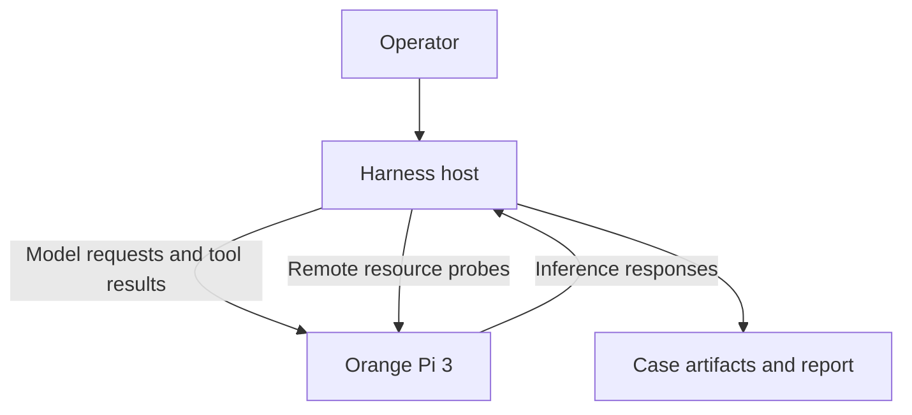

# Orange Pi Armbian LLM Evaluation - Plan

## Goal Capsule

- **Objective:** GripProbe can evaluate whether tool-calling LLMs are practically usable on an Orange Pi 3 with 2 GB RAM while keeping harness resource use off the device under test.
- **Means:** Run only the inference runtime and model on the ARM board; run the CLI agent, harness, validators, and reporting on a separate host.
- **Product authority:** This plan defines the constrained-device experiment, evidence, and result classification. It does not commit the project to a replacement for Ollama before Ollama is measured on the board.
- **Open blockers:** Select the first reference CLI agent and the minimum repeatability bar before implementation planning.

---

## Product Contract

### Summary

Add a constrained-device evaluation path for an Orange Pi 3 running Armbian with 2 GB RAM. The board hosts the LLM runtime and model, while GripProbe runs elsewhere and records tool-use correctness together with memory, zram, swap, and runtime evidence.

### Problem Frame

GripProbe already supports remote Ollama endpoints and remote system probes, and the repository contains several `rpi`-tagged model profiles. It does not contain an Orange Pi or Armbian hardware profile, detailed zram capture, or a suite bounded for a 2 GB device. The default suite includes models far beyond the memory capacity of this board.

The experiment must distinguish model capability from harness overhead. Running the harness or CLI agent on the board would consume the same limited memory as the model and make device comparisons harder to interpret.

### Key Decisions

- **Inference-only device under test.** (session-settled: user-directed - chosen over running GripProbe and the CLI agent on the board: separating the harness keeps device measurements focused on LLM inference.) Governs R1-R3.
- **Trial Ollama before adding another runtime.** Existing integration and telemetry make Ollama the baseline; a direct `llama.cpp` server becomes relevant only if measured Ollama behavior prevents a viable run. Governs R4 and R14.
- **Keep stock zram in the primary profile.** The primary result represents practical Armbian behavior, while a no-zram diagnostic distinguishes compressed-swap operation from physical-RAM fit. Governs R8-R10.
- **Separate protocol smoke tests from general agent tests.** FunctionGemma is useful for a narrow single-turn infrastructure check but must not be scored as a general multi-step agent model. Governs R11-R13.

### Actors

- A1. The operator selects the device profile, model profile, CLI agent, and test slice, then interprets the constrained-device classification.
- A2. The harness host runs GripProbe, the CLI agent, validators, telemetry capture, and report generation.
- A3. The Orange Pi runs Armbian, the inference runtime, and one loaded model.

### Evaluation Topology

### Requirements

**Execution boundary**

- R1. The Orange Pi must run only the inference runtime and selected LLM during a measured case.
- R2. The harness host must run the CLI agent, case orchestration, tools, validators, artifact persistence, and reporting.
- R3. Every result must identify the board as the inference device and the separate machine as the harness host so their resource measurements cannot be confused.
- R4. The first implementation must use Ollama as the measured baseline through the existing remote-backend path.

**Resource controls and evidence**

- R5. The initial constrained profile must allow only one loaded model and one active inference request.
- R6. The first 1.7B trial must start with a 1024-token context; larger contexts must be reported as separate configurations.
- R7. Every case must record model identity, digest, quantization, context length, runtime version, parallelism, OS and kernel identity, CPU architecture, physical memory, and relevant runtime settings.
- R8. The primary Armbian profile must keep its stock zram configuration and record actual zram and swap configuration rather than assuming image defaults.
- R9. Each measured run must record zram and swap use before and after the case, plus enough in-run evidence to distinguish incidental use from sustained memory pressure.
- R10. A secondary no-zram diagnostic must determine whether the same model configuration fits in physical RAM; it must not replace the stock-Armbian primary result.

**Model roles**

- R11. `functiongemma:270m` may be included only as a single-turn function-calling smoke profile that validates the endpoint and tool-call path.
- R12. `qwen3:0.6b` may serve as a small general-model control, while `qwen3:1.7b` is the primary constrained-device candidate.
- R13. `granite3.3:2b` may be included as a boundary or stress case; FunctionGemma, 2B boundary results, and general agent results must remain visibly distinct.
- R14. Quantization is part of the tested configuration: Q4 is the baseline for the 1.7B candidate, and any Q3 or Q2 result must be reported separately because quantization can change tool-calling quality.

**Result semantics**

- R15. Tool-use correctness must continue to come from actual workspace effects and validators rather than a model's textual claim of success.
- R16. Reports must classify a configuration as fitting physical RAM, working with limited zram use, operating under sustained memory pressure, or failing through OOM or timeout.
- R17. A runtime or transport failure must remain distinguishable from a model that completed inference but failed to call the required tool correctly.
- R18. The constrained-device suite must be explicitly bounded and must not inherit the full default model matrix.

### Key Flows

- F1. Constrained-device preflight
  - **Trigger:** The operator requests an Orange Pi run.
  - **Actors:** A1, A2, A3.
  - **Steps:** The harness verifies the remote endpoint, resolves the device and model configuration, records baseline memory and zram state, and refuses to label the run as constrained-device evidence when required identity or resource fields are missing.
  - **Outcome:** The case begins with attributable device and runtime metadata.
  - **Covered by:** R1-R9.

- F2. Tool-calling case execution
  - **Trigger:** Preflight succeeds.
  - **Actors:** A2, A3.
  - **Steps:** The external CLI agent sends the case through the remote inference runtime, executes returned tool calls on the harness workspace, and returns tool results to the model when the agent workflow requires another turn.
  - **Outcome:** GripProbe validates the measured workspace and preserves model, tool, timing, and resource evidence.
  - **Covered by:** R4-R7, R11-R15, R17.

- F3. Memory-fit classification
  - **Trigger:** A measured case finishes, times out, or is killed under memory pressure.
  - **Actors:** A1, A2, A3.
  - **Steps:** The harness combines validator outcome with memory, zram, swap, timeout, and runtime evidence, then assigns the constrained-device classification without converting resource failure into a model-quality result.
  - **Outcome:** The report states both tool-use correctness and practical memory fit.
  - **Covered by:** R8-R10, R16-R18.

### Acceptance Examples

- AE1. FunctionGemma infrastructure smoke
  - **Covers R11, R13, R15.**
  - **Given:** FunctionGemma is exposed through the board's Ollama endpoint with one shell tool.
  - **When:** A single-turn `shell_pwd`-class case completes and the expected artifact is validated.
  - **Then:** The result confirms the basic function-calling path and is labeled as specialized smoke evidence, not general agent capability.

- AE2. A 1.7B model fits physical RAM
  - **Covers R6-R10, R12, R14-R16.**
  - **Given:** Qwen3 1.7B Q4 runs with a 1024-token context and one active request.
  - **When:** The tool case passes and the no-zram diagnostic completes without OOM or sustained swap activity.
  - **Then:** The configuration is classified as fitting physical RAM.

- AE3. A 1.7B model depends on zram
  - **Covers R8-R10, R16.**
  - **Given:** The stock-Armbian run passes but the no-zram diagnostic fails or the primary run shows material compressed-swap use.
  - **When:** The report is generated.
  - **Then:** The configuration is classified as zram-dependent or under sustained memory pressure rather than simply marked compatible.

- AE4. Resource failure remains distinct
  - **Covers R16, R17.**
  - **Given:** The runtime is killed, cannot load the model, or exceeds the case timeout under memory pressure.
  - **When:** GripProbe evaluates the case.
  - **Then:** The report records a resource/runtime failure and does not present it as a normal no-tool-call model verdict.

### Success Criteria

- The Orange Pi path produces one attributable end-to-end tool-call smoke result without running the harness on the board.
- Qwen3 1.7B receives a reproducible correctness and memory-fit classification, whether the classification is usable, zram-dependent, or unsuitable.
- A report contains enough runtime and zram evidence for a reader to distinguish physical-RAM fit from compressed-swap survival.
- Existing non-ARM benchmark behavior and report semantics remain unchanged outside the constrained-device path.

### Scope Boundaries

- Running GripProbe or the CLI agent on the Orange Pi is outside this work.
- Running the full default model matrix on the 2 GB board is outside this work.
- Replacing Ollama before a measured Ollama trial is outside this work.
- Treating FunctionGemma as evidence of general multi-step agent ability is outside this work.
- Fine-tuning models for board-specific tool schemas is deferred until untuned constrained-device results establish a need.
- Publishing constrained-device results is separate from producing and validating local run artifacts.

### Dependencies and Assumptions

- The Orange Pi boots a 64-bit Armbian userspace and is reachable from the harness host over the model API and SSH or an equivalent probe channel.
- The official Ollama ARM64 package can run on the board's userspace; actual CPU compatibility and idle memory must be verified on the device.
- Armbian image defaults may vary, so zram size, algorithm, swappiness, and memory limit are observed inputs rather than fixed assumptions.
- Tool-call behavior depends on the CLI agent's prompt and tool schema as well as the model; comparisons are valid only when those inputs are held constant and reported.

### Outstanding Questions

**Resolve Before Planning**

- Which CLI agent is the first reference client for the constrained-device acceptance run?
- How many repeated successful measured cases are required before a configuration is called reproducible?

**Deferred to Planning**

- Select the exact mechanism for sampling zram, swap, and memory pressure without adding material load to the board.
- Define the installation and lifecycle procedure that guarantees one loaded model and one active request per measured configuration.

### Sources and Research

- Existing remote Ollama and SSH-probe workflow: `docs/usage.md`, `gripprobe/runner.py`, and `tests/unit/test_runner_runtime_metadata.py`.
- Existing constrained profiles: `specs/models/local_qwen3_1_7b_rpi.yaml` and `specs/models/local_granite3_3_2b_rpi.yaml`.
- Existing suite breadth: `specs/suites/default_cli_matrix.yaml`.
- Ollama ARM64 installation and memory controls: <https://docs.ollama.com/linux> and <https://docs.ollama.com/faq>.
- Armbian zram behavior and tuning: <https://docs.armbian.com/User-Guide_Armbian-Config/System/>.
- FunctionGemma scope and multi-step limitations: <https://ai.google.dev/gemma/docs/functiongemma/formatting-and-best-practices>.
